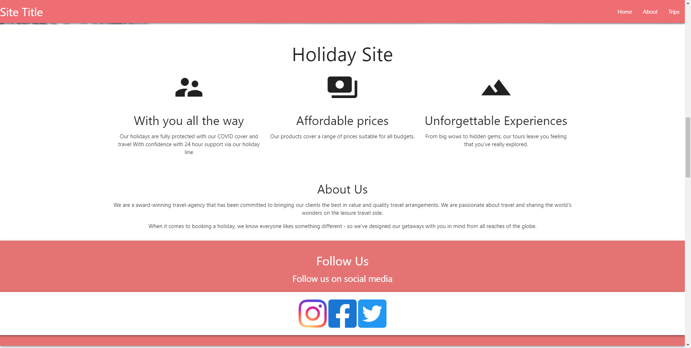

# Travel-Website
_A Travel Website using Materialize CSS and leafletJS_

## Summary
This is a website of a travel website with a interactive map showing you locations of travel sites the pages offers based off explore.co.uk

I created this as I normally just use vanilla css and wanted to learn a css framework to increase my speed and effieciently in creating sites.   
## Table of Content

## Whats is used in this project

### Languages
* javascript
    * materialize css
    * leafletJS
* css

## Parts of the site

### page

#### About Section
* parallax image above 
* used font awesome for the follow us icon links
* used materialize cards and material icons for the icons and slogans section

### Trip section

#### Map
Displays list of places the site offers places and is filtered by you have search for in the search bar above, (see if you can add hover box of information when you hover over the place icons)

##### Issues
Tired different options but didnt want to spend money on the google api. I then tried google my maps and atlist maps. However i found that they came with a watermarks of their company and were not very interactive. I then came across leafletJs which solved all my problems and i was able to interact with the map as it wa not a iframe and did not come with a large watermark.

#### List of Pages
displays all travel options and can be filter when you search for options when you search for places in the site about the map in the trip section

## Issues i had

## improvements

To Imporve this site I would make it more interactive by

I would also perhaps

PWA