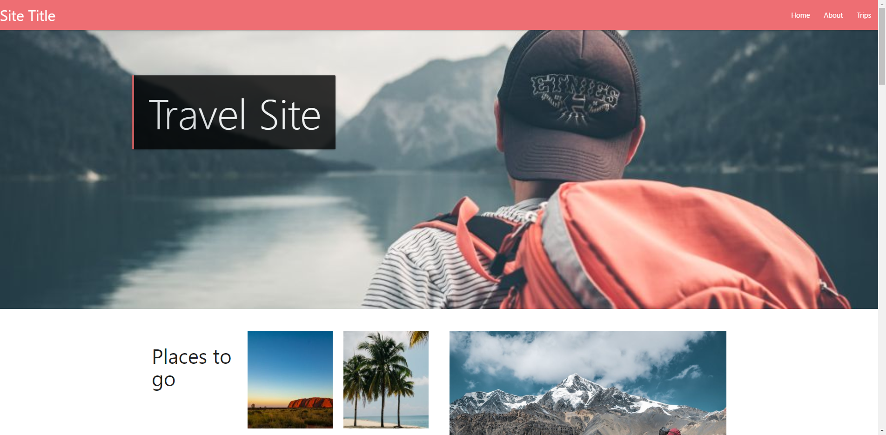

# Travel-Website
_A Travel Website using Materialize CSS and leafletJS_

## Summary
This is a travel website with an interactive map showing you locations of travel sites the page offers.

I created this as I normally use vanilla CSS and wanted to learn a CSS framework to increase my speed and efficiency in creating sites.
## Table of Content
* [Technologies used in this project](#Technologies-used-in-this-project)
* [Parts of the site](#Parts-of-the-site)
    * [Front Page](#Front-page)
    * [Trip section](#Trip-section)
* [Improvements](#Improvements)

### Technologies used in this project
* JavaScript
* Materialize CSS
* leafletJS
* CSS
* HTML

## Parts of the site

### Front Page

Has slider images as front-page section saying different slogans on each image.

Below is a "places to go" section in this section if you click on an image it enters the location of that image into the select element below. On submitting the select element, it scrolls down to the map and list of trips section and changes the value in the search bar to the entered location.

### Trip section

#### Map
Displays the list of places the site offers on a map and is filtered as you search in the search bar. Each marker can be hovered over to show the travel destination name. When clicking on the map marker, the page will scroll to the holiday information on the page.

I added a fullscreen plugin to LeafletJS and thought it would be fun to design a simple search bar in LeafletJS that filters the markers based on given keywords.
 

The Map has a fullscreen button using the LeafletJS fullscreen plugin. During fullscreen, the marker can be clicked, showing a popup of the travel information and an image.

##### Issues
I tried many different options but didn't want to spend money on the Google API maps or have large watermarks on options such as google free my maps or AtList maps. I finally decided on using LeafletJS which allowed me to change as much as I liked as it was not inside of an iframe.

#### List of holidays

Displays all travel options and can be filtered as you search for options when you search for places in the map search or in the trip section search.

## Improvements

1. Use different formats to decrease the size of images being downloaded making the page load and respond faster